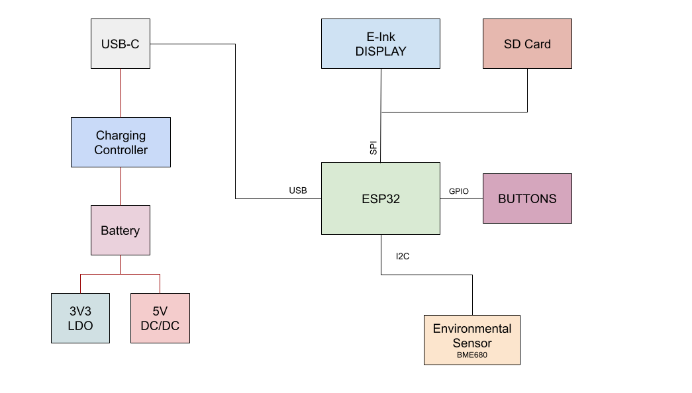

# OpenBook

An open source e-book reader based on ESP32.

## Block diagram

## Hardware features

The main component of the device is the `ESP32` microcontroller, which is responsible for all the processing and control of the device. The `ESP32` is a powerful microcontroller with built-in Wi-Fi and Bluetooth capabilities, making it ideal for IoT applications.

Apart from the microcontroller, we have:

- `E-Paper Display`: connected via SPI interface.
- `SD Card`: connected via SPI interface.
- `USB-C charging and protection`: connected to the battery and the microcontroller. It also has electro static discharge protection.
- `Environmental sensors`: connected via I2C interface. These sensors measure temperature, humidity, and pressure.

## Power consumption

The `ESP32` microcontroller consumes `~250 mA` when
in use.
The display uses `~15 mA` when active.
The environmental sensors use `~3 mA` when active.

In total when active, the device consumes `~270 mA`. Given
that the battery has a capacity of `1800 mAh`,
we should expect a battery life of `~6.5 hours` of continuous use.

## BOM

| Piece Name                  | Quantity | Link                                                                                                                                                                                                               |
| --------------------------- | -------- | ------------------------------------------------------------------------------------------------------------------------------------------------------------------------------------------------------------------ |
| ADAFRUIT_LEDCHIP-LED0603    | 1        | https://www.snapeda.com/parts/KP-1608SURCK/Kingbright/view-part/?ref=search&t=LED%200603                                                                                                                           |
| C0402                       | 1        | https://componentsearchengine.com/part-view/CC0402MRX5R5BB106/YAGEO                                                                                                                                                |
| 112ATAARR03                 | 1        | https://www.snapeda.com/parts/112A-TAAR-R03/Attend/view-part/                                                                                                                                                      |
| 744043680                   | 1        | https://eu.mouser.com/ProductDetail/Wurth-Elektronik/744043680?qs=PGXP4M47uW6VkZq%252BkzjrHA%3D%3D                                                                                                                 |
| BD5229G-TR                  | 1        | https://www.snapeda.com/parts/BD5229G-TR/Rohm/view-part/?ref=search&t=BD5229G-TR                                                                                                                                   |
| CPH3225A                    | 1        | https://www.snapeda.com/parts/CPH3225A/Seiko/view-part/                                                                                                                                                            |
| BUTTON_CUSYOMV1             | 3        | https://www.snapeda.com/search/?q=EVQP7L01P&search-type=parts                                                                                                                                                      |
| DS3231SN                    | 1        | https://www.snapeda.com/parts/DS3231SN%23/Analog%20Devices/view-part/?ref=search&t=DS3231SN%23                                                                                                                     |
| ESP32                       | 1        | https://www.snapeda.com/parts/ESP32-C6-WROOM-1-N8/Espressif%20Systems/view-part/?ref=search&t=ESP32-C6-WROOM-1-N8                                                                                                  |
| VARISTOR                    | 1        | https://ro.mouser.com/ProductDetail/EPCOS-TDK/B72520T0350K062?qs=dEfas%2FXlABIszF52uu7vrg%3D%3D                                                                                                                    |
| SD0805S020S1R0              | 1        | https://componentsearchengine.com/part-view/SD0805S020S1R0/Kyocera%20AVX                                                                                                                                           |
| BME680                      | 1        | https://www.snapeda.com/parts/BME680/Bosch%20Sensortec/view-part/?ref=search&t=bme680                                                                                                                              |
| R0402                       | 1        | https://componentsearchengine.com/part-view/R0402%201%25%20100%20K%20(RC0402FR-07100KL)/YAGEO                                                                                                                      |
| MOSFET                      | 1        | https://componentsearchengine.com/part-view/DMG2305UX-7/Diodes%20Incorporated                                                                                                                                      |
| MCP73831                    | 1        | https://componentsearchengine.com/part-view/MCP73831T-2ACI%2FOT/Microchip                                                                                                                                          |
| SRJ                         | 1        | https://componentsearchengine.com/part-view/FH34SRJ-24S-0.5SH(99)/Hirose                                                                                                                                           |
| MBR0530                     | 1        | https://www.snapeda.com/parts/MBR0530/Onsemi/view-part/                                                                                                                                                            |
| PGB1010603MR                | 1        | https://www.snapeda.com/parts/PGB1010603MR/Littelfuse/view-part/                                                                                                                                                   |
| QWIIC_CONNECTOR             | 1        | https://www.snapeda.com/parts/PRT-14417/SparkFun/view-part/                                                                                                                                                        |
| RCL_CPOL-EU                 | 1        | https://grabcad.com/library/tantalum-smd-capacitor-type-b-3528-1                                                                                                                                                   |
| SAMACSYS_PARTS_USB4110-GF-A | 1        | https://www.snapeda.com/parts/USB4110-GF-A./Global%20Connector%20Technology/view-part/                                                                                                                             |
| SI1308EDL-T1-GE3            | 1        | https://www.snapeda.com/parts/SI1308EDL-T1-GE3/Vishay/view-part/                                                                                                                                                   |
| USBLC6-2SC6Y                | 1        | https://www.snapeda.com/parts/USBLC6-2SC6Y/STMicroelectronics/view-part/?ref=dk&t=USBLC6-2SC6Y&con_ref=None                                                                                                        |
| W25Q512JVEIQ                | 1        | https://www.snapeda.com/parts/W25Q512JVEIQ/Winbond%20Electronics/view-part/?ref=search&t=W25Q512JVEIQ                                                                                                              |
| XC6220A331MR-G              | 1        | https://ro.mouser.com/ProductDetail/Torex-Semiconductor/XC6220A331MR-G?qs=AsjdqWjXhJ8ZSWznL1J0gg%3D%3D&utm_source=octopart&utm_medium=aggregator&utm_campaign=865-XC6220A331MR-G&utm_content=Torex%20Semiconductor |
